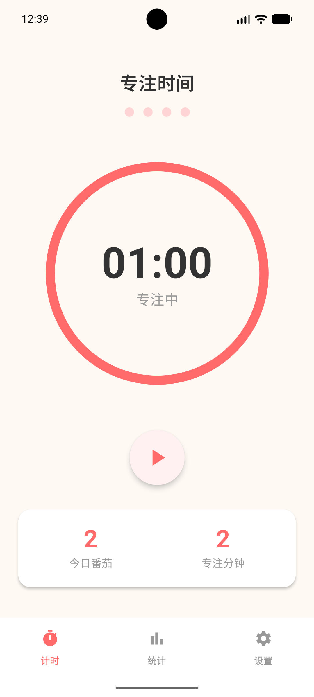
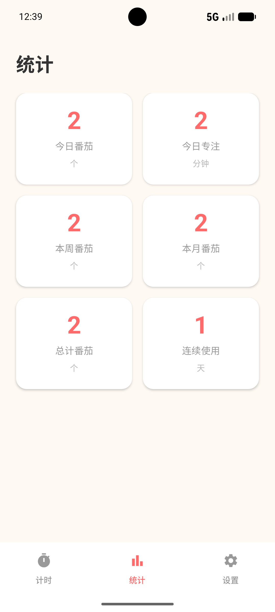
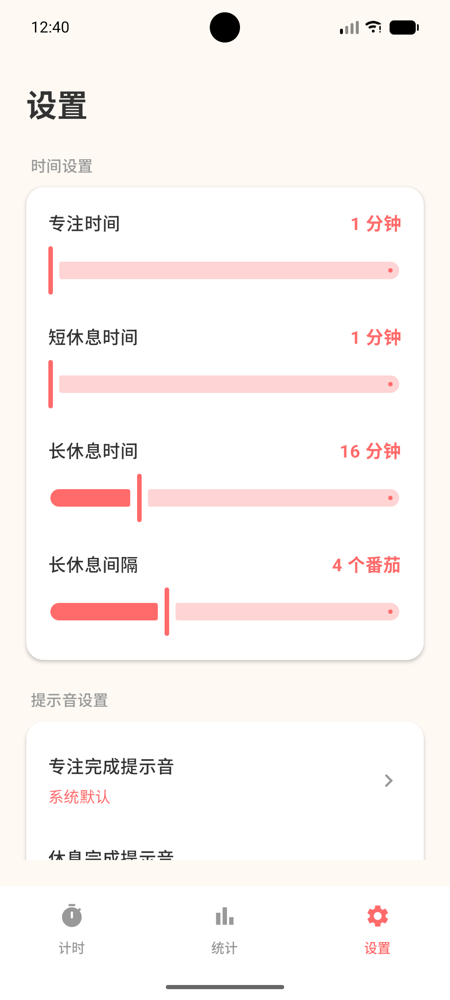

# Pomodoro Timer

一个简洁优雅的番茄钟 Android 应用，使用 Kotlin + Jetpack Compose 开发。

> **Vibe Coding Project** - 这是一个 Vibe Coding 项目，从零到完成大约花费了半天时间。整个开发过程由 AI 辅助完成，包括架构设计、UI 实现、功能开发到最终的 bug 修复。

## 截图

<p align="center">
  
  
  
</p>

## 功能特性

- **番茄计时器** - 支持专注、短休息、长休息三种模式
- **自定义时长** - 专注 1-120 分钟，短休息 1-20 分钟，长休息 1-60 分钟
- **铃声提醒** - 计时完成后播放提示音，支持自定义铃声选择
- **使用统计** - 查看今日/本周/本月/总计番茄数，以及连续使用天数
- **后台运行** - 前台服务保证计时器在后台持续运行
- **现代化 UI** - 采用 Material Design 3，番茄红暖色风格

## 技术架构

### 技术栈

| 类别 | 技术 |
|------|------|
| 语言 | Kotlin 2.2.10 |
| UI 框架 | Jetpack Compose + Material 3 |
| 架构模式 | MVVM |
| 依赖注入 | 手动依赖注入 (Manual DI) |
| 本地数据库 | Room 2.8.4 |
| 偏好存储 | DataStore Preferences |
| 异步处理 | Kotlin Coroutines + Flow |
| 导航 | Navigation Compose |

### 项目结构

```
app/src/main/java/com/github/dgxz99/pomodoro/
├── data/
│   ├── local/              # Room 数据库 (Entity, Dao, Database)
│   ├── preferences/        # DataStore 偏好设置
│   └── repository/         # 数据仓库层
├── domain/
│   └── model/              # 领域模型 (TimerMode, TimerState)
├── service/
│   └── TimerService.kt     # 前台计时服务
├── ui/
│   ├── components/         # 可复用 UI 组件
│   ├── navigation/         # 导航配置
│   ├── screens/            # 页面 (Timer, Stats, Settings)
│   └── theme/              # 主题配置
├── util/
│   └── NotificationHelper.kt  # 通知工具类
├── viewmodel/              # ViewModel 层
└── MainActivity.kt         # 入口 Activity
```

### 数据流

```
UI (Compose) <--> ViewModel <--> Repository <--> Room Database
                      ^                              DataStore
                      |
                  TimerService (前台服务)
```

## 构建指南

### 环境要求

- **JDK**: Java 17+
- **Android SDK**: API 36 (Android 14)
- **Android Studio**: Meerkat (2024.3.1) 或更高版本

### 构建步骤

1. **克隆仓库**

```bash
git clone https://github.com/dgxz99/Pomodoro.git
cd Pomodoro
```

2. **配置环境变量**

```bash
export ANDROID_HOME=$HOME/Android/Sdk
export JAVA_HOME=/path/to/java17  # 例如: /usr/lib/jvm/java-17-openjdk
```

3. **构建 Debug APK**

```bash
./gradlew assembleDebug
```

构建完成后，APK 文件位于 `app/build/outputs/apk/debug/app-debug.apk`

4. **构建 Release APK**（需要签名配置）

```bash
./gradlew assembleRelease
```

### 使用构建脚本

项目提供了便捷的构建脚本：

```bash
./build.sh
```

## 配置说明

| 配置项 | 值 |
|--------|-----|
| minSdk | 24 (Android 7.0) |
| targetSdk | 36 (Android 14) |
| compileSdk | 36 |
| 包名 | com.github.dgxz99.pomodoro |

## 权限说明

| 权限 | 用途 |
|------|------|
| `POST_NOTIFICATIONS` | 显示计时通知 |
| `FOREGROUND_SERVICE` | 后台计时服务 |
| `VIBRATE` | 计时完成振动提醒 |

## 开源协议

本项目采用 [MIT License](LICENSE) 开源协议。

## 致谢

- [Jetpack Compose](https://developer.android.com/jetpack/compose) - 现代化 Android UI 工具包
- [Material Design 3](https://m3.material.io/) - Google 设计规范
- [Room](https://developer.android.com/training/data-storage/room) - Android 持久化库
